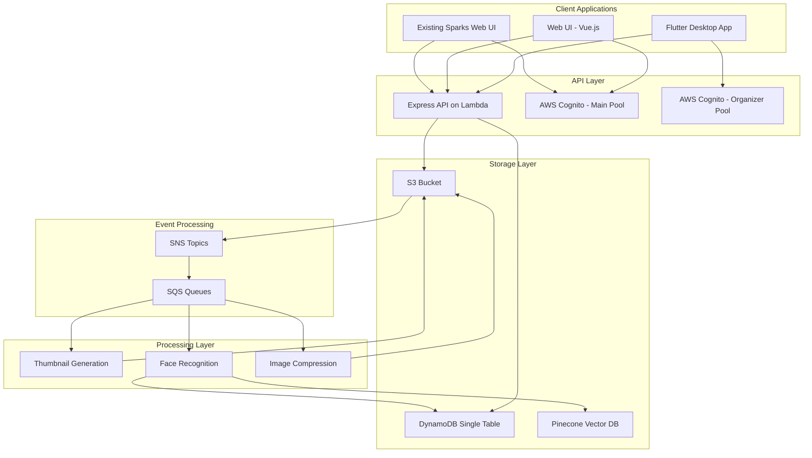
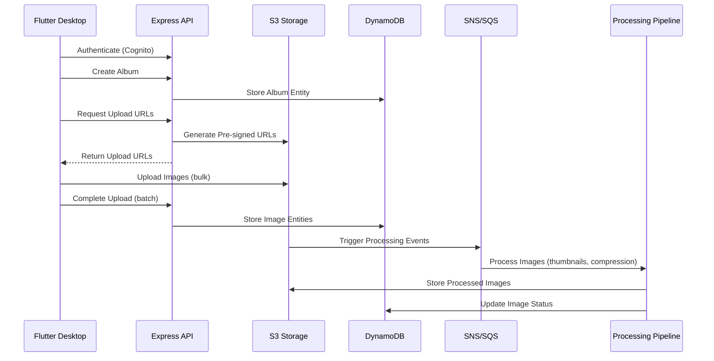

# Design Document

## Overview

This design extends the existing Sparks photo sharing platform to support event organizers who need professional-grade image management capabilities. The solution introduces a new user role (Event Organizer), a Flutter desktop application for bulk image uploads, and enhanced web viewing capabilities while leveraging the existing AWS serverless infrastructure.

The design maintains the current single-table DynamoDB pattern and serverless architecture while adding new data entities and API endpoints specifically for event organizer workflows. The system will support both the existing personal photo sharing functionality and the new event organizer features through role-based access control.

## Architecture

### High-Level Architecture



### Data Flow for Event Organizer Workflow



## Components and Interfaces

### 1. Authentication Architecture

#### Separate Cognito User Pools
The system will use two distinct Cognito User Pools to maintain separation between regular users and event organizers:

**Main User Pool (Existing)**
- Used by existing Sparks web UI
- Supports self-registration and social login
- For personal photo sharing users
- Pool Name: `{prefix}_sparks_user_pool`

**Event Organizer User Pool (New)**
- Used exclusively by Flutter desktop application
- **No self-registration allowed** - admin-only user creation
- For professional event organizers only
- Pool Name: `{prefix}_event_organizer_user_pool`
- Configuration:
  ```json
  {
    "allowAdminCreateUserOnly": true,
    "allowSelfRegistration": false,
    "temporaryPasswordValidityDays": 7,
    "requireVerifiedEmail": true
  }
  ```

#### HTTP API Gateway Multi-Pool Authentication

AWS HTTP API Gateway supports multiple JWT authorizers. We'll configure two authorizers:

**Terraform Configuration:**
```hcl
# Main user pool authorizer (existing)
resource "aws_apigatewayv2_authorizer" "main_cognito" {
  api_id           = aws_apigatewayv2_api.main.id
  authorizer_type  = "JWT"
  identity_sources = ["$request.header.Authorization"]
  name             = "main-cognito-authorizer"

  jwt_configuration {
    audience = [var.cognito_client_id]
    issuer   = "https://cognito-idp.${var.aws_region}.amazonaws.com/${var.cognito_user_pool_id}"
  }
}

# Event organizer pool authorizer (new)
resource "aws_apigatewayv2_authorizer" "organizer_cognito" {
  api_id           = aws_apigatewayv2_api.main.id
  authorizer_type  = "JWT"
  identity_sources = ["$request.header.Authorization"]
  name             = "organizer-cognito-authorizer"

  jwt_configuration {
    audience = [var.organizer_cognito_client_id]
    issuer   = "https://cognito-idp.${var.aws_region}.amazonaws.com/${var.organizer_cognito_user_pool_id}"
  }
}
```

**Route-Level Authorization:**
```hcl
# Routes for regular users
resource "aws_apigatewayv2_route" "photos" {
  api_id             = aws_apigatewayv2_api.main.id
  route_key          = "GET /photos"
  target             = "integrations/${aws_apigatewayv2_integration.lambda.id}"
  authorization_type = "JWT"
  authorizer_id      = aws_apigatewayv2_authorizer.main_cognito.id
}

# Routes for event organizers
resource "aws_apigatewayv2_route" "organizer_albums" {
  api_id             = aws_apigatewayv2_api.main.id
  route_key          = "GET /albums"
  target             = "integrations/${aws_apigatewayv2_integration.lambda.id}"
  authorization_type = "JWT"
  authorizer_id      = aws_apigatewayv2_authorizer.organizer_cognito.id
}

# Public routes (no authorization)
resource "aws_apigatewayv2_route" "public_albums" {
  api_id             = aws_apigatewayv2_api.main.id
  route_key          = "GET /public/albums"
  target             = "integrations/${aws_apigatewayv2_integration.lambda.id}"
  authorization_type = "NONE"
}
```

#### Express API Authentication Handling
The Express API will receive JWT claims from API Gateway and determine user type:

```javascript
// Middleware to handle multiple user pool contexts
const authenticateUser = (req, res, next) => {
  // API Gateway passes JWT claims in event.requestContext.authorizer.jwt.claims
  const claims = req.apiGateway?.event?.requestContext?.authorizer?.jwt?.claims;
  
  if (!claims) {
    return res.status(401).json({ error: 'Unauthorized' });
  }
  
  // Determine user type based on token issuer or custom claims
  const issuer = claims.iss;
  
  if (issuer.includes(process.env.ORGANIZER_USER_POOL_ID)) {
    req.userType = 'EVENT_ORGANIZER';
    req.userEmail = claims.email;
  } else if (issuer.includes(process.env.MAIN_USER_POOL_ID)) {
    req.userType = 'REGULAR_USER';
    req.userEmail = claims.email;
  } else {
    return res.status(401).json({ error: 'Invalid token issuer' });
  }
  
  next();
};

// Route-specific middleware for organizer-only endpoints
const requireOrganizer = (req, res, next) => {
  if (req.userType !== 'EVENT_ORGANIZER') {
    return res.status(403).json({ error: 'Organizer access required' });
  }
  next();
};

// Apply middleware to routes
app.use('/albums', authenticateUser, requireOrganizer, albumsRouter);
app.use('/photos', authenticateUser, photosRouter);
app.use('/public', publicRouter); // No authentication required
```

#### User Management Process
1. **Admin creates organizer account** via AWS Console or CLI
2. **Temporary password sent** to organizer's email
3. **First login requires password change** in Flutter app
4. **Organizer profile automatically created** in DynamoDB on first login

#### Route Authorization Strategy

**Organizer-Only Routes** (Organizer Cognito Pool):
- `POST /albums` - Create album
- `PUT /albums/:id` - Update album
- `DELETE /albums/:id` - Delete album
- `POST /albums/:id/images` - Add images to album
- `GET /organizers/me/*` - Organizer profile and data
- `POST /upload/batch` - Batch upload endpoints

**Regular User Routes** (Main Cognito Pool):
- `GET /photos` - Personal photos
- `GET /users/*` - User management
- `GET /me/*` - Personal profile
- `POST /upload` - Single image upload

**Shared Routes** (Both Pools Accepted):
- `GET /persons` - Person detection (shared)
- `GET /event-photos` - Event photos viewing
- `PUT /persons/:id` - Update person names

**Public Routes** (No Authentication):
- `GET /public/albums` - Public album listing
- `GET /public/albums/:id` - Public album viewing
- `POST /events` - Event logging

### 2. Data Model Extensions

#### Data Separation Strategy

The system will support multiple viewing contexts with different data filtering:

**Entity Types:**
- **Personal Photos**: `entityType: "IMAGE"` (existing)
- **Event Photos**: `entityType: "EVENT_IMAGE"` (new)

**Viewing Contexts:**
1. **Main Sparks Feed**: Shows only personal photos (`entityType = IMAGE`)
2. **Event Photos Tab**: Shows only event organizer photos (`entityType = EVENT_IMAGE`)
3. **Album Views**: Shows photos within specific albums
4. **Person Detection**: Shared across both personal and event photos

**Face Recognition Strategy:**
- **Person entities are shared** between personal and event photos
- **Person tagging works for both** `IMAGE` and `EVENT_IMAGE` entities
- **Web UI shows all persons** detected across both photo types
- **Standalone app shows persons** filtered by organizer's photos only

#### Reusing Existing Entities

**User Entity (Reused with Extensions)**
The existing User entity will be extended to support event organizers by adding role-specific attributes:

```json
{
  "PK": "organizer@example.com",
  "SK": "organizer@example.com", 
  "entityType": "USER",
  "email": "organizer@example.com",
  "username": "ABC Events",
  "userType": "EVENT_ORGANIZER",
  "organizationName": "ABC Events",
  "storageQuota": 10737418240,
  "storageUsed": 1073741824,
  "createdAt": "2025-08-01T10:00:00.000Z",
  "isActive": true
}
```

**Event Image Entity (Modified Image Structure)**
Event organizer images will use the same structure as regular images but with a different `entityType` to maintain separation:

```json
{
  "PK": "image-uuid-789",
  "SK": "UPLOADED_BY#organizer@example.com",
  "entityType": "EVENT_IMAGE",
  "imageId": "image-uuid-789",
  "assetType": "IMAGE",
  "uploadedBy": "organizer@example.com",
  "uploaded_datetime": "2025-08-01T10:30:00.000Z",
  "lastModified": "2025-08-01T10:30:00.000Z",
  "s3Key": "originals/image-uuid-789.jpg",
  "images": {
    "large": "processed/image-uuid-789_large.webp",
    "medium": "processed/image-uuid-789_medium.webp",
    "processedAt": "2025-08-01T10:35:00.000Z"
  },
  "persons": [],
  "tags": [],
  "albumId": "album-uuid-123",
  "metadata": {
    "originalFileName": "IMG_001.jpg",
    "fileSize": 2048576,
    "dimensions": {"width": 4000, "height": 3000}
  }
}
```

**User Upload Limit Entity (Reused)**
The existing upload limit pattern will be reused for event organizers:

```json
{
  "PK": "LIMIT#organizer@example.com",
  "SK": "organizer@example.com",
  "entityType": "DEFAULT_LIMIT", 
  "limit": 1000
}
```

**Person Entity (Reused - Shared Across All Photos)**
The existing Person entity remains unchanged and is shared between personal and event photos:

```json
{
  "PK": "PERSON#person1",
  "SK": "person1",
  "entityType": "PERSON",
  "displayName": "person1",
  "s3Key": "persons/person1.jpg",
  "createdAt": 1754040302
}
```

**Person Tagging Entity (Reused - Works for Both Photo Types)**
The existing tagging pattern works for both personal and event photos:

```json
{
  "PK": "image-uuid-789",
  "SK": "PERSON#person1",
  "entityType": "TAGGING#person1",
  "s3Key": "processed/image-uuid-789_large.webp",
  "createdAt": 1754040302
}
```

#### New Entities Required

**Album Entity**
```json
{
  "PK": "ALBUM#album-uuid-123",
  "SK": "METADATA",
  "entityType": "ALBUM",
  "albumId": "album-uuid-123",
  "name": "Wedding Reception 2025",
  "description": "Beautiful wedding reception photos",
  "eventDate": "2025-07-15",
  "createdBy": "organizer@example.com",
  "createdAt": "2025-08-01T10:00:00.000Z",
  "visibility": "public",
  "imageCount": 150,
  "coverImageId": "image-uuid-456",
  "isDefault": false
}
```

**Default "Others" Album Entity**
```json
{
  "PK": "ALBUM#others-organizer@example.com",
  "SK": "METADATA",
  "entityType": "ALBUM",
  "albumId": "others-organizer@example.com",
  "name": "Others",
  "description": "Images not assigned to specific albums",
  "eventDate": "1970-01-01",
  "createdBy": "organizer@example.com",
  "createdAt": "2025-08-01T10:00:00.000Z",
  "visibility": "private",
  "imageCount": 0,
  "isDefault": true
}
```

**Album Image Association Entity**
```json
{
  "PK": "ALBUM#album-uuid-123",
  "SK": "IMAGE#image-uuid-789",
  "entityType": "ALBUM_IMAGE",
  "albumId": "album-uuid-123",
  "imageId": "image-uuid-789",
  "addedAt": "2025-08-01T10:30:00.000Z",
  "sortOrder": 1
}
```

### 2. API Endpoints Extensions

#### Event Organizer Management
- `GET /organizers/me` - Get current organizer profile
- `PUT /organizers/me` - Update organizer profile
- `GET /organizers/me/storage` - Get storage usage statistics

#### Album Management
- `GET /albums` - List albums (with role-based filtering, includes default "Others" album)
- `POST /albums` - Create new album
- `GET /albums/:albumId` - Get album details
- `PUT /albums/:albumId` - Update album metadata (cannot update default "Others" album)
- `DELETE /albums/:albumId` - Delete album (moves all images to "Others" album, cannot delete "Others" album)
- `GET /albums/:albumId/images` - Get images in album (paginated)
- `POST /albums/:albumId/images` - Add images to album (batch)
- `DELETE /albums/:albumId/images/:imageId` - Remove image from album (moves to "Others" album)
- `POST /organizers/me/albums/others` - Create default "Others" album (called automatically on first organizer login)

#### Event Photos for Web UI
- `GET /event-photos` - Get all event organizer photos (for Event Photos tab)
- `GET /event-photos/:id` - Get specific event photo details
- `GET /event-photos/:id/persons` - Get persons in specific event photo

#### Bulk Upload Management
- `POST /upload/batch` - Get multiple pre-signed URLs for batch upload
- `POST /upload/batch/complete` - Complete batch upload with metadata
- `GET /upload/progress/:batchId` - Get upload progress status

#### Public Album Viewing
- `GET /public/albums` - List public albums
- `GET /public/albums/:albumId` - Get public album details
- `GET /public/albums/:albumId/images` - Get public album images (filtered by `entityType = EVENT_IMAGE`)

#### Person Management (Shared)
- `GET /persons` - Get all persons (from both personal and event photos)
- `GET /persons/:personId` - Get person details
- `GET /persons/:personId/photos` - Get all photos containing person (both types)
- `GET /persons/:personId/event-photos` - Get only event photos containing person
- `GET /organizers/me/persons` - Get persons detected in current organizer's photos only

#### API Filtering Strategy
- **Existing `/photos` endpoints**: Filter by `entityType = IMAGE` (unchanged)
- **New `/event-photos` endpoints**: Filter by `entityType = EVENT_IMAGE`
- **Person endpoints**: Query both entity types unless specifically filtered
- **Organizer-specific endpoints**: Filter by both `entityType = EVENT_IMAGE` AND `uploadedBy = {organizer_email}`

### 3. Flutter Desktop Application Architecture

#### Core Components
```dart
// Authentication Service
class AuthService {
  Future<bool> signIn(String email, String password);
  Future<void> signOut();
  Future<String?> getCurrentUserToken();
}

// Album Service
class AlbumService {
  Future<List<Album>> getAlbums();
  Future<Album> createAlbum(CreateAlbumRequest request);
  Future<Album> updateAlbum(String albumId, UpdateAlbumRequest request);
  Future<void> deleteAlbum(String albumId);
}

// Upload Service
class UploadService {
  Future<BatchUploadResponse> requestBatchUpload(List<File> files, String albumId);
  Stream<UploadProgress> uploadFiles(BatchUploadResponse response);
  Future<void> completeBatchUpload(String batchId, List<ImageMetadata> metadata);
}

// Storage Service
class StorageService {
  Future<StorageInfo> getStorageInfo();
  Stream<StorageInfo> watchStorageInfo();
}
```

#### UI Components
- **Login Screen**: Cognito authentication (login only, no registration)
- **Dashboard**: Storage usage, recent albums, quick actions
- **Album List**: Grid view of albums with metadata
- **Album Detail**: Image grid with upload area and drag-and-drop
- **Upload Progress**: Real-time upload status with retry capabilities
- **Settings**: Profile management and preferences

### 4. Web UI Integration Decision

Based on the analysis of the existing webUI structure and the requirements, the recommendation is to **extend the existing webUI** rather than create a standalone application. This approach provides:

#### Benefits of Integration:
- Unified user experience across personal and event photos
- Shared authentication and infrastructure
- Reduced maintenance overhead
- Consistent design language and components

#### Implementation Approach:
- Add new Vue.js routes for album viewing (`/events`, `/events/:albumId`)
- Create new Vuetify components for album grid and image gallery
- Implement role-based navigation and feature access
- Add public album viewing without authentication requirement

#### New Vue Components:
```javascript
// EventPhotosTab.vue - Tab showing all event organizer photos
// EventAlbumList.vue - Grid of public event albums
// EventAlbumDetail.vue - Image gallery for specific album
// EventImageViewer.vue - Full-screen image viewer with navigation
// AlbumCard.vue - Reusable album preview component
// SharedPersonsView.vue - Shows persons detected across all photo types
```

#### Web UI Navigation Structure:
```
Main Navigation:
├── Photos (existing personal photos)
├── Event Photos (new tab - all event organizer photos)
├── Albums (public event albums)
└── People (shared persons from both photo types)
```

## Data Models

### DynamoDB Access Patterns

#### Event Organizer Patterns (Reusing User Entity)
1. **Get organizer by email**: `PK = {email}, SK = {email}` with filter `userType = EVENT_ORGANIZER`
2. **List all organizers**: Query GSI `entityType-PK-index` with `entityType = USER` and filter `userType = EVENT_ORGANIZER`
3. **Get organizer storage limit**: `PK = LIMIT#{email}, SK = {email}` (reuses existing pattern)

#### Album Patterns
1. **Get album metadata**: `PK = ALBUM#{albumId}, SK = METADATA`
2. **List albums by organizer**: Query GSI `entityType-PK-index` with `entityType = ALBUM` and filter `createdBy = {email}` (includes default "Others" album)
3. **Get album images**: Query with `PK = ALBUM#{albumId}` and `SK begins_with IMAGE#`
4. **List public albums**: Query GSI `entityType-PK-index` with `entityType = ALBUM` and filter `visibility = public AND isDefault != true`
5. **Get default "Others" album**: `PK = ALBUM#others-{email}, SK = METADATA`
6. **Move images to "Others" album**: Update album associations from source album to "Others" album

#### Image Patterns (Separated by Entity Type)
1. **Get event image**: Query with `PK = {imageId}` and filter `entityType = EVENT_IMAGE`
2. **List images by album**: Query with `PK = ALBUM#{albumId}` and `SK begins_with IMAGE#`
3. **List event images by organizer**: Query GSI `uploadedBy-PK-index` with `uploadedBy = {email}` and filter `entityType = EVENT_IMAGE`
4. **List personal images (existing)**: Query GSI `entityType-PK-index` with `entityType = IMAGE` (unchanged)
5. **List event images for public viewing**: Query GSI `entityType-PK-index` with `entityType = EVENT_IMAGE`

#### Person Patterns (Shared Across Photo Types)
1. **Get all persons**: Query GSI `entityType-PK-index` with `entityType = PERSON` (unchanged)
2. **Get person details**: `PK = PERSON#{personId}, SK = {personId}` (unchanged)
3. **Get all photos with person**: Query GSI `entityType-PK-index` with `entityType begins_with TAGGING#{personId}`
4. **Get event photos with person**: Query GSI `entityType-PK-index` with `entityType begins_with TAGGING#{personId}` then filter by source image type
5. **Get organizer's photos with person**: Combine person tagging query with `uploadedBy` filter

### S3 Storage Structure (Reusing Existing Paths)

```
bucket-name/
├── originals/                    # All original images (personal + event)
│   ├── {imageId}.jpg            # Personal photos (existing)
│   └── {imageId}.jpg            # Event photos (new, same structure)
├── processed/                    # All processed images (personal + event)
│   ├── {imageId}_large.webp     # Personal + Event (existing structure)
│   └── {imageId}_medium.webp    # Personal + Event (existing structure)
└── persons/                      # Face recognition (shared)
    └── {personId}.jpg           # Persons from all photo types
```

**Benefits of Reusing Existing Structure:**
- **No Lambda function changes**: Existing face recognition, thumbnail generation, and compression functions work unchanged
- **Unified processing pipeline**: Same S3 triggers and SNS/SQS processing for all images
- **Shared face recognition**: Persons detected in event photos are immediately available for personal photos and vice versa
- **CloudFront optimization**: Single CDN configuration serves all processed images
- **Simplified infrastructure**: No need for separate processing paths or duplicate Lambda functions
- **Cost efficiency**: Reuses existing processing capacity and storage optimization

**Implementation Strategy:**
- Event organizer images use the same S3 paths as personal photos
- Differentiation happens at the DynamoDB level through `entityType`
- Album association is stored in DynamoDB metadata, not S3 structure
- Existing processing pipeline handles both photo types transparently

## Error Handling

### Flutter Desktop Application
- **Network Errors**: Retry mechanism with exponential backoff
- **Upload Failures**: Individual file retry with progress preservation
- **Authentication Errors**: Automatic token refresh with fallback to re-login
- **Storage Quota Exceeded**: Clear error messages with upgrade options
- **File Format Errors**: Pre-upload validation with user feedback

### API Error Responses
```json
{
  "error": "STORAGE_QUOTA_EXCEEDED",
  "message": "Upload would exceed storage quota",
  "details": {
    "currentUsage": 9663676416,
    "quota": 10737418240,
    "requestedSize": 1073741824
  }
}
```

### Web UI Error Handling
- **Album Not Found**: Graceful 404 page with navigation options
- **Access Denied**: Clear messaging for private albums
- **Loading Failures**: Retry buttons and fallback content
- **Image Load Errors**: Placeholder images with retry options

## Testing Strategy

### Unit Testing
- **Flutter**: Widget tests for UI components, unit tests for services
- **API**: Jest tests for route handlers and business logic
- **Lambda Functions**: Unit tests for image processing functions

### Integration Testing
- **API Integration**: Test complete workflows from authentication to data storage
- **S3 Integration**: Test upload, processing, and retrieval workflows
- **DynamoDB Integration**: Test all access patterns and data consistency

### End-to-End Testing
- **Flutter Desktop**: Automated UI tests for complete user workflows
- **Web UI**: Cypress tests for album viewing and navigation
- **Cross-Platform**: Test data consistency between desktop and web interfaces

### Performance Testing
- **Bulk Upload**: Test upload performance with large batches (100+ images)
- **Album Loading**: Test pagination and loading performance for large albums
- **Concurrent Users**: Test system behavior under concurrent organizer usage

### Security Testing
- **Authentication**: Test role-based access controls
- **Authorization**: Test album visibility and access permissions
- **Data Isolation**: Verify proper separation between organizer and personal data
- **Input Validation**: Test API endpoints with malicious inputs

## Performance Considerations

### Upload Optimization
- **Parallel Uploads**: Support concurrent file uploads with configurable limits
- **Chunked Uploads**: Implement multipart uploads for large files
- **Progress Tracking**: Real-time progress updates with bandwidth estimation
- **Resume Capability**: Support upload resume after network interruptions

### Image Processing
- **Batch Processing**: Process multiple images from same album together
- **Priority Queues**: Prioritize thumbnail generation for immediate viewing
- **Resource Management**: Optimize Lambda memory allocation for image processing
- **Caching**: Implement CloudFront caching for processed images

### Database Performance
- **Pagination**: Implement efficient pagination for large albums
- **Indexing**: Optimize GSI usage for common query patterns
- **Batch Operations**: Use DynamoDB batch operations for bulk data operations
- **Connection Pooling**: Optimize database connections in Lambda functions

### Web UI Performance
- **Lazy Loading**: Implement progressive image loading for large albums
- **Virtual Scrolling**: Use virtual scrolling for albums with many images
- **Image Optimization**: Serve appropriate image sizes based on viewport
- **Caching Strategy**: Implement browser caching for album metadata