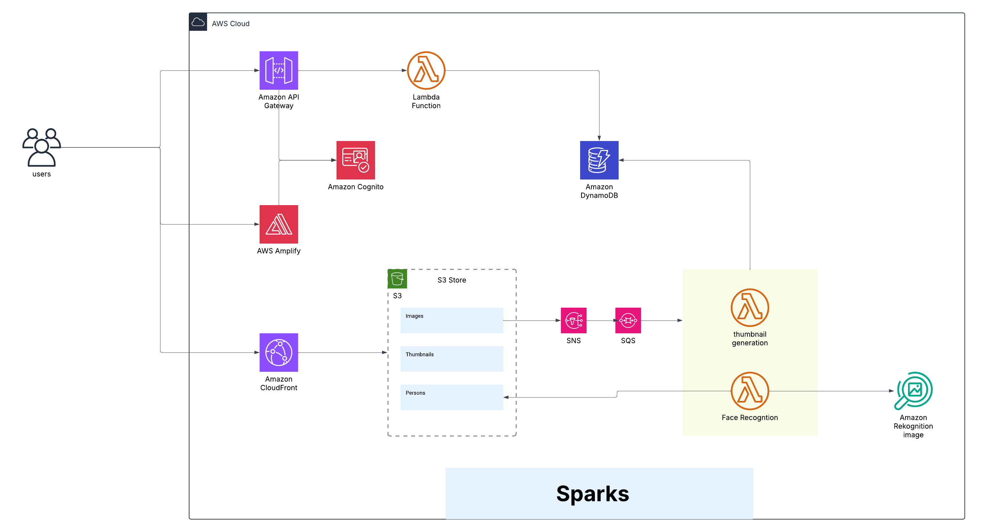

# Sparks - Photo Sharing Platform

## Never lose event memories again!

You know the problem - everyone takes photos at events but they stay scattered across different phones. Most memories get lost.

**Sparks solves this.** Our AI-powered platform automatically organizes event photos by recognizing faces, making it effortless to find and share memories with the right people.

---

Sparks is a modern, cloud-native photo sharing platform designed for performance, scalability, and rich user experiences. It allows users to upload, manage, and share their photos securely with AI-powered face recognition and automated processing.

## Core Features

- **Secure User Authentication**: Managed by AWS Cognito, providing robust user sign-up, sign-in, and profile management with custom email templates
- **Dynamic Image Processing**: Automatic thumbnail generation, image compression, and AI-powered face recognition for intelligent photo tagging
- **Scalable Serverless Backend**: Built entirely on AWS serverless technologies (Lambda, S3, DynamoDB, SNS, SQS) for high availability and pay-per-use cost efficiency
- **Responsive Web Interface**: A reactive front-end built with Vue.js 3 and Vuetify for a seamless experience across all devices
- **Landing Page**: Professional Nuxt.js 3 landing page with contact form and Cloudflare Turnstile protection
- **Event-Driven Architecture**: Fully asynchronous processing pipeline for image uploads and face recognition
- **Custom Domain Support**: Full custom domain support with automatic SSL certificates via ACM
- **Automated Cleanup System**: Optional cleanup system for development environments

## Architecture Overview

The application follows a serverless-first, event-driven architecture leveraging AWS services for maximum scalability and cost efficiency.

### High-Level Architecture Diagram



_Note: The diagram above shows the core components. The actual implementation includes additional services detailed below._

## Detailed Component Architecture

### Front-End Applications

#### Main Web Application (`webUI/`)

- **Framework**: Vue.js 3 + Vite + Vuetify
- **State Management**: Pinia
- **Hosting**: AWS Amplify with CloudFront distribution
- **Features**:
  - Responsive photo gallery with infinite scroll
  - Real-time image upload with progress tracking
  - Face recognition results display
  - User profile management
  - Admin feedback management

#### Landing Page (`landingPage/`)

- **Framework**: Nuxt.js 3 + Tailwind CSS
- **Hosting**: CloudFront + Lambda Function URLs
- **Features**:
  - Professional landing page
  - Contact form with Cloudflare Turnstile protection
  - SNS email notifications
  - SEO optimized

### Back-End Services

#### API Layer

- **Express API Lambda**: Main application API with JWT authentication
- **HTTP API Gateway**: AWS API Gateway v2 with Cognito JWT authorizer
- **Custom Domain**: Route53 + ACM certificate management
- **Provisioned Concurrency**: Optional for consistent performance

#### Authentication & Authorization

- **AWS Cognito**: User pools and identity pools
- **Custom Email Templates**: SES integration for branded emails
- **Custom Domain**: Branded authentication URLs
- **JWT Tokens**: Verified at both API Gateway and application level

#### Data Storage

- **DynamoDB**: Single-table design for all application data
  - Users, images, persons, tagging relationships
  - GSI/LSI for efficient query patterns
  - See `data_model.md` for complete schema
- **S3 Buckets**:
  - `originals/`: Original uploaded images
  - `processed/`: Thumbnails and processed variants
  - `persons/`: Face recognition person images
- **SSM Parameter Store**: Secure configuration and secrets

#### Event-Driven Processing Pipeline

##### Image Upload Flow

1. User requests upload URL from Express API
2. API generates pre-signed S3 PUT URL
3. Client uploads directly to S3 `originals/` prefix
4. S3 ObjectCreated event triggers SNS topic
5. SNS fans out to SQS thumbnail generation queue

##### Thumbnail Generation

1. SQS message triggers `image_thumbnail_generation` Lambda
2. Lambda downloads original, creates multiple sizes
3. Uploads processed images to S3 `processed/` prefix
4. Updates DynamoDB with image metadata
5. Publishes completion message to SNS FIFO topic

##### Face Recognition (Dual Implementation)

1. SNS FIFO topic triggers SQS FIFO face recognition queue
2. Two Lambda options (configurable):
   - **Custom Container**: Python-based face recognition with Pinecone
   - **AWS Rekognition**: Managed service alternative
3. Results stored in DynamoDB with person associations

#### Content Delivery

- **CloudFront Distributions**:
  - UI Distribution: Serves web application
  - Assets Distribution: Serves images with OAC
- **Signed URLs**: Time-bound access to private images
- **Custom Domains**: Branded URLs with SSL certificates

### Infrastructure Components

#### DNS & Certificates

- **Route53**: DNS management for all custom domains
- **ACM**: SSL certificates (multi-region for CloudFront)
- **Domain Validation**: Automated certificate validation

#### Email Services

- **SES**: Custom domain email sending
- **Domain Verification**: SPF/DKIM records via Route53
- **Cognito Integration**: Branded authentication emails

#### Monitoring & Logging

- **CloudWatch**: Centralized logging and metrics
- **Lambda Insights**: Performance monitoring
- **Custom Metrics**: Application-specific monitoring

#### Development Tools

- **Cleanup System**: Automated environment reset (dev only)
  - Clears DynamoDB tables
  - Removes Cognito users
  - Cleans S3 buckets
  - Resets Pinecone index
  - Invalidates CloudFront cache

### Infrastructure as Code (IaC)

#### Terraform Modules

- **Primary IaC**: Modular Terraform setup in `terraform/`
- **Environment Overlays**: `terraform/environments/{dev,prod,demo}/`
- **Modules**:
  - `acm`: SSL certificate management
  - `amplify`: Web application hosting
  - `cleanup_system`: Development environment cleanup
  - `cloudfront`: CDN distributions
  - `cloudwatch`: Monitoring and logging
  - `cognito`: Authentication services
  - `dynamodb`: Database tables and indexes
  - `http-api`: API Gateway configuration
  - `iam`: Roles and policies
  - `lambda`: Function deployments
  - `route53`: DNS management
  - `s3`: Storage buckets
  - `ses`: Email services
  - `sns_sqs`: Event messaging

#### CloudFormation

- **Landing Page**: `landingPage/infrastructure/cloudformation-template.yaml`
- **Lambda Function URLs**: Contact form backend

## Getting Started

### Prerequisites

- Node.js 18+
- AWS CLI configured
- Terraform 1.0+
- An AWS account with appropriate permissions

### Quick Start

1. **Clone the repository**

   ```bash
   git clone <repository-url>
   cd sparks
   ```

2. **Set up Pinecone API key** (required for face recognition)

   ```bash
   ./scripts/setup-pinecone-api-key.sh <YOUR_API_KEY> <AWS_REGION>
   ```

3. **Deploy infrastructure** (automated)

   ```bash
   node scripts/create_env.js dev [AMPLIFY_APP_ID]
   ```

   Or manually:

   ```bash
   cd terraform
   terraform init
   terraform apply -var-file="environments/dev/variables.tfvars"
   ```

4. **Deploy web application**

   ```bash
   cd webUI
   npm install
   npm run build
   # Deploy to Amplify (manual or via script)
   ```

5. **Deploy landing page**
   ```bash
   cd landingPage
   npm install
   npm run build
   aws cloudformation deploy --template-file infrastructure/cloudformation-template.yaml --stack-name sparks-marketing
   ```

### Development Setup

#### Local API Development

```bash
cd src/express-api
cp .env .env.local  # Customize as needed
npm install
npm run dev         # Runs with nodemon
```

#### Local Web Development

```bash
cd webUI
npm install
npm run dev         # Vite dev server
```

#### Local Landing Page

```bash
cd landingPage
npm install
npm run dev         # Nuxt dev server
```

## Configuration

### Environment Variables

#### Terraform Variables (`terraform/environments/*/variables.tfvars`)

```hcl
# Core Configuration
prefix = "dev"
aws_region = "us-east-1"
environment = "development"

# Custom Domains (optional)
enable_custom_domain = true
domain_name = "yourdomain.com"
ui_custom_domain = "app.yourdomain.com"
api_custom_domain = "api.yourdomain.com"
assets_custom_domain = "assets.yourdomain.com"

# Face Recognition
pinecone_api_env = "us-east-1-aws"
pinecone_index_name = "sparks-faces"
use_aws_rekognition_service = false  # true for AWS Rekognition

# Performance
enable_provisioned_capacity = false
provisioned_capacity_value = 5

# Development
cleanup_schedule_enabled = false  # Enable for dev environments
```

#### Web Application (`.env` files)

```bash
# webUI/.env
VITE_API_BASE_URL=https://api.yourdomain.com
VITE_COGNITO_USER_POOL_ID=us-east-1_xxxxxxxxx
VITE_COGNITO_CLIENT_ID=xxxxxxxxxxxxxxxxxxxxxxxxxx

# landingPage/.env
NUXT_PUBLIC_CONTACT_API_URL=https://contact.yourdomain.com/api/contact
```

### SSM Parameters

- `/pinecone/sparks`: Pinecone API key
- `/sparks/{prefix}/cloudfront/private_key`: CloudFront signing key

## Deployment Strategies

### Multi-Environment Setup

```bash
# Development
node scripts/create_env.js dev

# Production
node scripts/create_env.js prod

# Demo/Staging
node scripts/create_env.js demo
```

### Custom Domain Setup

1. Configure Route53 hosted zone
2. Update `terraform/environments/*/variables.tfvars`
3. Run Terraform apply
4. Certificates are automatically provisioned via ACM

### Face Recognition Options

- **Custom Container**: Advanced face recognition with Pinecone
- **AWS Rekognition**: Managed service alternative
- Toggle via `use_aws_rekognition_service` in Terraform variables

## Monitoring & Observability

### CloudWatch Integration

- **Lambda Logs**: Centralized logging for all functions
- **API Gateway Logs**: Request/response logging
- **Custom Metrics**: Application-specific monitoring
- **Alarms**: Automated alerting for critical issues

### Performance Monitoring

- **Lambda Insights**: Function performance metrics
- **CloudFront Metrics**: CDN performance and caching
- **DynamoDB Metrics**: Database performance and throttling

## Security Features

### Authentication & Authorization

- **JWT Tokens**: Verified at multiple layers
- **Cognito Integration**: Managed user authentication
- **Custom Email Templates**: Branded user communications
- **Session Management**: Secure token handling

### Data Protection

- **Encryption at Rest**: S3 and DynamoDB encryption
- **Encryption in Transit**: HTTPS/TLS everywhere
- **Signed URLs**: Time-bound access to private content
- **IAM Least Privilege**: Minimal required permissions

### Network Security

- **CloudFront OAC**: Origin Access Control for S3
- **API Gateway**: Rate limiting and throttling
- **VPC Endpoints**: Private AWS service communication (where applicable)

## Cleanup System

⚠️ **WARNING: The cleanup system is destructive and will permanently delete all user data!**

The cleanup system provides automated environment reset capabilities for development:

### Features

- **DynamoDB**: Delete and recreate tables
- **Cognito**: Remove all users (preserve pool configuration)
- **S3**: Clear persons folder
- **Pinecone**: Reset vector index
- **CloudFront**: Invalidate cached assets

### Management

```bash
# Enable/disable via Terraform
cleanup_schedule_enabled = false  # Default: disabled for safety
```

For detailed cleanup documentation, see `terraform/modules/cleanup_system/README.md`.

## API Documentation

### Express API Routes

- **Authentication**: `/auth/*` - User authentication flows
- **Images**: `/images/*` - Image upload and management
- **Users**: `/users/*` - User profile management
- **Persons**: `/persons/*` - Face recognition results
- **Upload**: `/upload/*` - Pre-signed URL generation

For complete API documentation, see `src/express-api/README.md`.

### Data Model

For comprehensive database schema and access patterns, see `data_model.md`.

## Contributing

### Development Workflow

1. Create feature branch
2. Develop locally using dev environment
3. Test with cleanup system for fresh state
4. Deploy to demo environment for integration testing
5. Create pull request for production deployment

### Code Standards

- **Frontend**: ESLint + Prettier for Vue.js/Nuxt.js
- **Backend**: Node.js best practices for Lambda
- **Infrastructure**: Terraform formatting and validation
- **Documentation**: Keep README and data model updated

## Troubleshooting

### Common Issues

#### Face Recognition Not Working

- Verify Pinecone API key in SSM Parameter Store
- Check Lambda function logs in CloudWatch
- Ensure proper IAM permissions for Pinecone access

#### Images Not Loading

- Verify CloudFront distribution is deployed
- Check S3 bucket permissions and OAC configuration
- Validate signed URL generation in Express API

#### Authentication Issues

- Confirm Cognito configuration matches frontend
- Check JWT token validation in API Gateway logs
- Verify custom domain certificates are valid

#### Deployment Failures

- Check Terraform state for resource conflicts
- Verify AWS credentials and permissions
- Review CloudFormation stack events for errors

### Support Resources

- **CloudWatch Logs**: Centralized logging for all components
- **AWS X-Ray**: Distributed tracing (if enabled)
- **Terraform State**: Infrastructure state management
- **GitHub Issues**: Community support and bug reports

---

**Sparks** - Bringing your photos to life with AI-powered organization and sharing.
